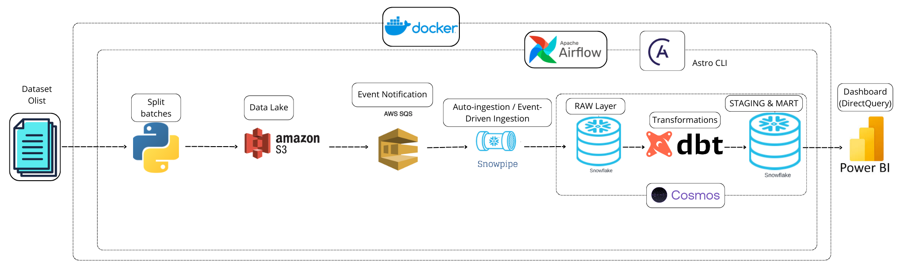
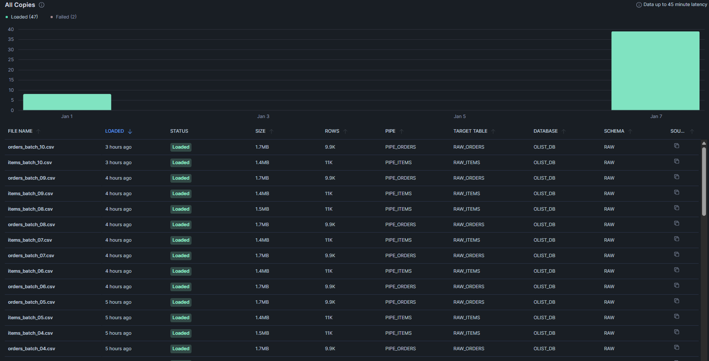
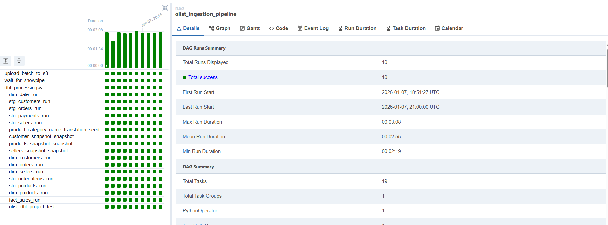
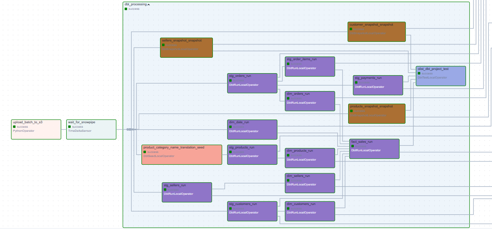
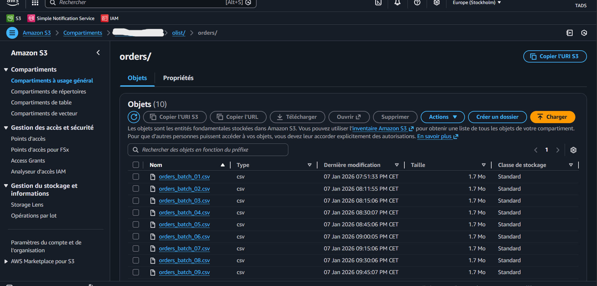
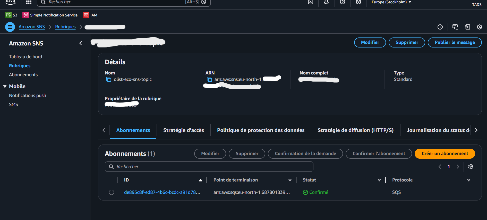
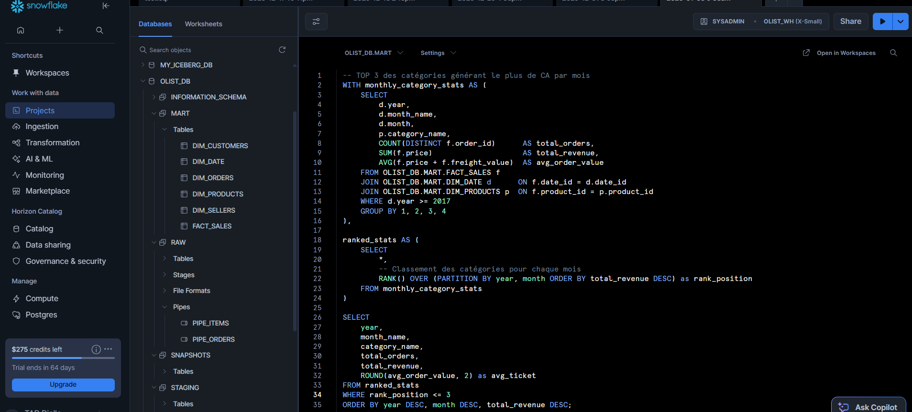
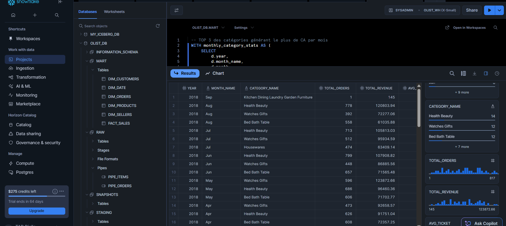
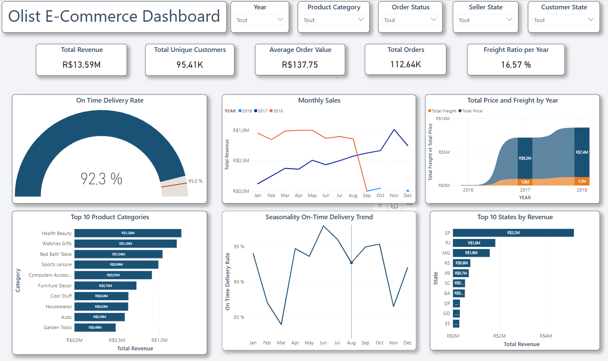

## 📋 Présentation du Projet

Ce projet démontre la mise en place d'une infrastructure **Data Engineering moderne et automatisée**.
L'objectif était de simuler un environnement de production réel où les données transactionnelles arrivent en continu, sont ingérées automatiquement, transformées via des modèles analytiques, et visualisées en quasi temps réel.

Le projet s’appuie sur le dataset public **Olist E-Commerce**, représentant une marketplace brésilienne reliant vendeurs indépendants et clients finaux.

Au-delà de l’aspect technique, ce projet met en lumière des **enjeux business et sociétaux concrets**, notamment :

* la fiabilité des délais de livraison, essentielle à la satisfaction client,
* la performance des vendeurs selon les régions,
* l’impact des coûts logistiques (freight) sur le chiffre d’affaires,
* les disparités géographiques d’accès au e-commerce.

Pour reproduire des conditions proches d'un environnement de production, les données ont été volontairement ingérées de manière progressive (batchs), orchestrées par Apache Airflow, afin d’évaluer les problématiques d’automatisation, de coûts et de performance propres aux plateformes data modernes.

## 🏗️ Architecture du Pipeline

### Le flux de données étape par étape :

1.  **Data Generation :** Un script Python découpe les fichiers volumineux (`orders`, `order_items`) en 10 lots (chunks) pour simuler une arrivée de données quotidienne/horaire.
2.  **Orchestration (Airflow) :** Un DAG Airflow (géré via **Astro CLI** et **Cosmos**) upload un chunk vers AWS S3.
3.  **Continuous Ingestion (Snowpipe) :** Configuration d'un système **Event-Driven** (AWS S3 Event Notification -> SQS -> Snowpipe). Dès qu'un fichier atterrit sur S3, Snowflake l'ingère automatiquement dans la couche `RAW`.
4.  **Transformation (dbt) :** Airflow déclenche les modèles dbt (via Cosmos) *uniquement* après avoir confirmé l'ingestion des données par Snowpipe, transformant les données brutes en un modèle en étoile (Kimball).
5.  **Visualization :** Power BI est connecté en **Direct Query** à Snowflake pour des tableaux de bord à jour instantanément.

## 🛠️ Focus Technique & Défis relevés

### 1. Ingestion "Event-Driven" avec Snowpipe
Au lieu d'un chargement manuel (`COPY INTO`), j'ai mis en place une automatisation via **AWS SNS/SQS**.
*   **Challenge :** Synchroniser l'orchestrateur (Airflow) avec un processus asynchrone (Snowpipe).
*   **Solution :** Le DAG Airflow upload le fichier, puis attend que la pipe soit "flushed" avant de lancer la suite.

### 2. Orchestration avancée avec Airflow & Cosmos
J'ai utilisé la bibliothèque **Cosmos** pour intégrer dbt comme citoyen de première classe dans Airflow. Cela permet de visualiser chaque modèle dbt comme une tâche distincte dans le DAG.

*   **Logique du DAG :** `Upload to S3` >> `Wait for Ingestion` >> `dbt Run (Staging -> Marts)` >> `Data Quality Tests`.

### 3. Continuous Ingestion (Snowpipe & AWS)
Mise en place d'une architecture **Event-Driven** (pilotée par événements) pour assurer un chargement des données en quasi temps réel, sans intervention manuelle.

*   **S3 Landing Zone (Data Lake) :** Configuration des buckets S3 pour recevoir les fichiers CSV découpés (chunks). Organisation stricte des dossiers pour séparer les flux.
    *   
    *   

*   **Event Architecture (SNS/SQS) :** Configuration des **S3 Event Notifications** pour déclencher un message automatique via SNS/SQS à chaque nouvel upload. Cela permet de découpler le stockage de l'ingestion.
    *   

*   **Automated Loading (Snowpipe) :** Côté Snowflake, un **Pipe** configuré en `AUTO_INGEST=TRUE` écoute la file d'attente SQS. Dès qu'un message arrive, le fichier correspondant est chargé instantanément dans les tables `RAW`.

### 4. Modélisation Dimensionnelle (dbt)
Transformation des données brutes vers un **Star Schema** (Modèle de Kimball) optimisé pour l'analyse.
*   **Staging :** Nettoyage, typage et déduplication.
*   **Marts :** Création de `FACT_SALES` et des dimensions (`DIM_PRODUCTS`, `DIM_CUSTOMERS`, etc.).
*   **Qualité :** Tests dbt (`unique`, `not_null`, `relationships`) intégrés au pipeline pour bloquer les données corrompues.

### 4. Advanced Analytics & Reporting (SQL)
Validation du modèle en étoile par des requêtes analytiques complexes directement dans Snowflake.
L'exemple ci-dessous montre une analyse des "Top Catégories Mensuelles" utilisant :
*   **CTEs (Common Table Expressions)** pour la lisibilité.
*   **Window Functions** (`RANK() OVER PARTITION`) pour le classement.
*   **Joins** entre la Fact Table et les Dimensions.

## 📊 Business Intelligence (Power BI)

Le dashboard final permet de suivre les KPIs logistiques et financiers d'Olist. Grâce au **Direct Query**, toute nouvelle donnée traitée par le pipeline est immédiatement visible sans rafraîchissement manuel du dataset.

**KPIs Clés :**
*   Revenue & Croissance monthly.
*   On-Time Delivery Rate (Performance Logistique).
*   Analyse géographique des ventes.

## 🏅 Certifications & Badges Snowflake

Ce projet met en application les compétences acquises lors de mes formations Snowflake.

*   ❄️ [**Data Engineering Workshop**](https://achieve.snowflake.com/4a69085a-2363-4222-8c7f-98b368b9704e#acc.K6umWHng)
*   ❄️ [**Data Lake Workshop**](https://achieve.snowflake.com/95cf50e3-f66c-4f7f-bf7b-5e212bac2214#acc.hjQKqy84)
*   ❄️ [**Data Warehousing Workshop**](https://achieve.snowflake.com/eceb04a5-7082-4eab-a009-2ad245dd3fe5#acc.AJHzaXGZ)
*   ❄️ [**Data Application Builders Workshop**](https://achieve.snowflake.com/89a954c3-936c-47d1-9f20-4baf0f16747b#acc.5yEpF4Pw)
*   ❄️ [**Collaboration, Marketplace & Cost Estimation**](https://achieve.snowflake.com/91c3f0d0-2376-4ef2-87af-d68dc42ec201#acc.ZOzQVcGJ)

---

## 👤 Auteur

**Thierno Amadou DIALLO**
*Cloud Data Engineer | Snowflake | AWS | dbt*

[LinkedIn](https://www.linkedin.com/in/thierno-amadou-diallo-84b4481b7/)
